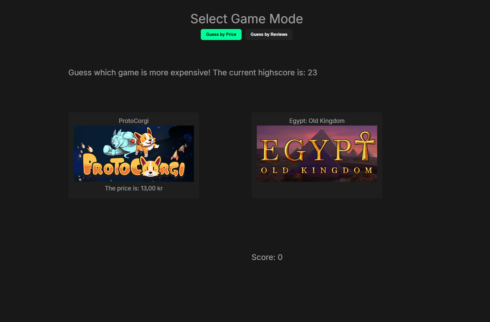
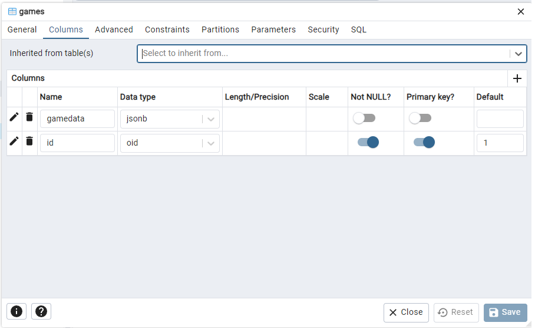
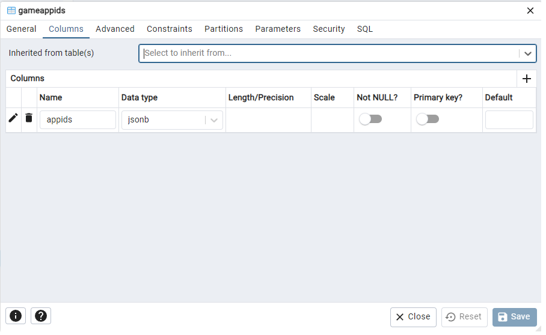
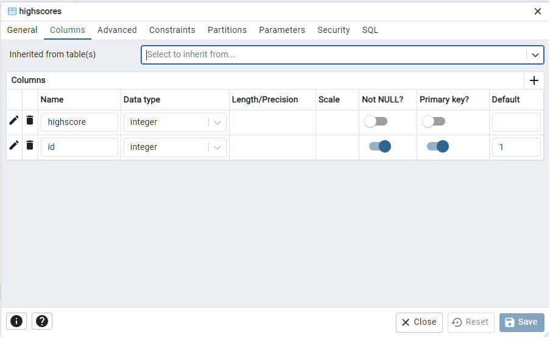

# Higher Lower Game 

Test the game at [Game link](https://tommymaii.github.io/HigherLowerFrontend/) (It will some time to boot if the server is sleeping.)




## About 

This project is my attempt at a full-stack application and a fun game to play with my friends. It is inspired by the popular "Higher or Lower" game. In this game you get a set of 2 games and your job is to guess which of the 2 either has the higher price or more reviews. 

The program uses a postgres database to save the data, Node with Express for its backend and Vue frontend. It also has endpoints that connects to the SteamAPI, to get SteamAppIds and Steam game data. 

Picture of the app.

## How to build

```
    Open a terminal in the HigherLowerApi folder (Either direct to it directly in the terminal or 
    right click the folder in your IDE and press open in terminal. )
    
    write `npm install` in the terminal and execute the command. (if you dont have node installed you need to install that first)

    This project also uses a .env file. Either create a .env file or populate with your credentials manually.

    Example .env file:

    STEAM_API_KEY=your_steam_api_key
    PORT=your_port_number
    DBUSER=your_database_user
    DBPASS=your_database_password
    DB=your_database_name

    Example of my PostgreSQL database it has 2 tables.

    games - Contains a column named gamedata of type JSONB, which stores game-related data.
    gameappids - Contains a column named appids of type JSONB, which stores Steam App IDs.

    If you want to test out the steamAPI endpoints you will also need to get a Steam API Key which you can get from this page:
    https://steamcommunity.com/dev

    the only thing you need to do is to swap out the key in the allGameURL variable in the db.js file.

    After node has installed the packages then either run the index.js file or use the command `node index.js` in the terminal. 

    You should then get a Server is up message in your terminal, this means your server is up and running.

    Then open a terminal in the HigherLowerClient folder

    Here you only need to do a `npm install` then `npm run dev` to start the frontend side of the application. 
```
## Tech Stack

**Client:** Vue

**Server:** Node, Express

Database Images






